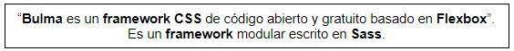
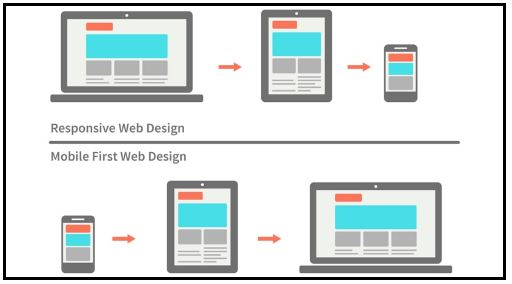
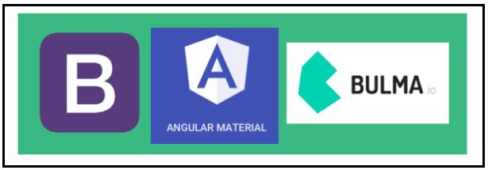
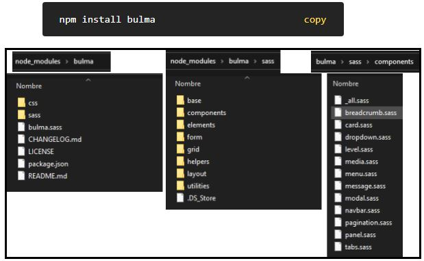
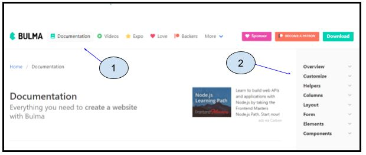
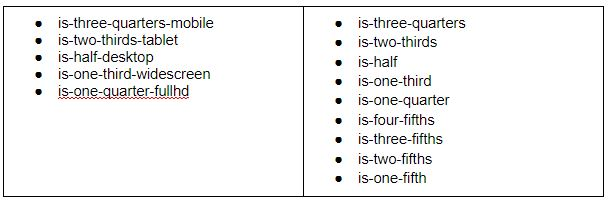

# Introducción a Bulma CSS

- [Link](https://bulma.io/)
- [Link](https://sass-lang.com/)

## ¿Qué es Bulma Css?

## ¿Qué lo hace especial?

## ¿Cuál elegir y para qué casos?

## ¿Cómo se instala?

## ¿Cómo se empieza?

## ¿Qué clases tengo que tener en cuenta?
Estas son las opciones que podemos usar para controlar el ancho de columna:

